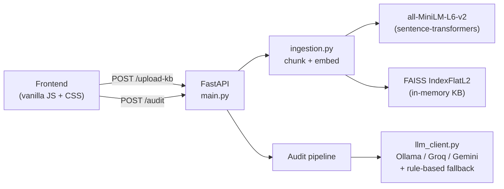
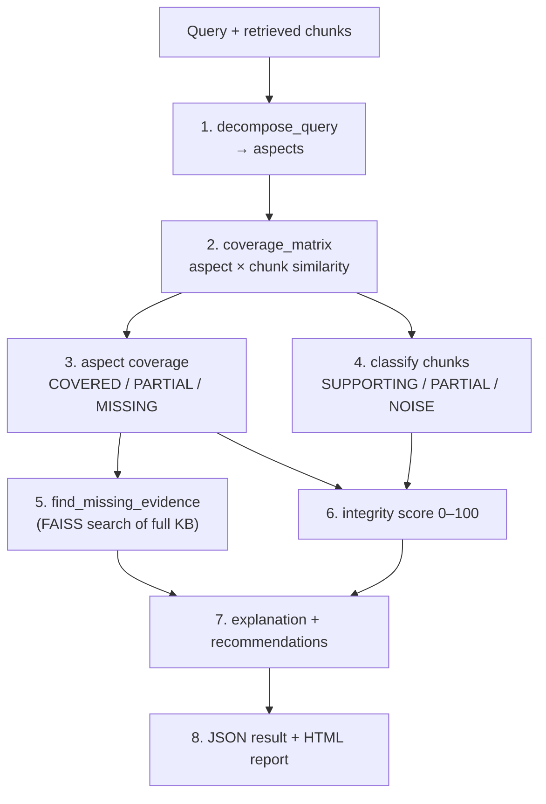

# RAG Retrieval Integrity Auditor

Audit the **retrieval** step of a RAG pipeline *before* generation. Paste a query and the chunks your retriever returned, and the auditor tells you which parts of the question were actually covered, which retrieved chunks are noise, what evidence was missed, and how to fix it — with a transparent 0–100 integrity score.

> Runs fully offline with a rule-based engine (zero API keys). Optionally plugs into a free LLM (Ollama / Groq / Gemini) for richer explanations.

---

## Why

RAG systems retrieve documents before generating an answer, but retrieval fails silently — pulling irrelevant chunks, missing critical evidence, or over-relying on the top-1 match — and fluent generation hides it. Most tools evaluate only the final answer, never the retrieval that produced it. This auditor makes retrieval quality **visible, measurable, and explainable** instead of a black box, so you know the right evidence was retrieved *before* an answer is shown.

## What it does

| Capability | Output |
|---|---|
| **Aspect decomposition** | Splits the query into 3–6 sub-aspects it must answer |
| **Coverage matrix** | Cosine similarity of every aspect × chunk |
| **Chunk classification** | Labels each chunk `SUPPORTING` / `PARTIAL` / `NOISE` |
| **Missing-evidence detection** | Searches the full FAISS index for relevant chunks that *weren't* retrieved |
| **Integrity score (0–100)** | Transparent formula with coverage base + noise/partial penalties |
| **Recommendations** | Typed, actionable fixes (query rewrite, chunking, hybrid search, threshold, reranking) |
| **Ground-truth eval** *(optional)* | Precision / Recall / F1 vs. labeled relevant chunks, with missed-relevant + noise breakdown |

Every result is returned as **machine-readable JSON** and as a **human-readable HTML report + interactive dashboard** (heatmap, evidence drill-down, missing-evidence, fixes).

---

## Architecture



## Audit pipeline



---

## Scoring

```
base            = (covered_aspects / total_aspects) × 100
noise_penalty   = noise_ratio × 20            # noise_chunks / total_chunks
partial_penalty = partial_aspects × 5
final_score     = clamp(base − noise_penalty − partial_penalty, 0, 100)
```

Coverage drives the score; noise and partial coverage subtract from it. Thresholds:

| Aspect status | Best similarity | | Chunk class | Max similarity |
|---|---|---|---|---|
| `COVERED` | ≥ 0.40 | | `SUPPORTING` | ≥ 0.40 |
| `PARTIAL` | 0.24 – 0.40 | | `PARTIAL` | 0.25 – 0.40 |
| `MISSING` | < 0.24 | | `NOISE` | < 0.25 |

Bands: **0–40** low · **41–70** medium · **71–100** high integrity.

---

## Quick start

```bash
pip install -r requirements.txt

# (optional) configure a free LLM provider
cp .env.example .env          # default LLM_PROVIDER=fallback works with no key

cd backend
python main.py                # serves API + UI at http://localhost:8000
```

Open <http://localhost:8000>, click **Load demo** (HR / E-commerce / Healthcare / Education), then **Run Audit**. Each demo ships with labeled ground truth, so the precision/recall/F1 panel appears automatically.

### API

```bash
# 1. Upload knowledge base (PDF/TXT)
curl -F "files=@demo/knowledge_base.txt" http://localhost:8000/upload-kb

# 2. Run an audit (see demo/demo_query.json for the request shape)
curl -X POST http://localhost:8000/audit \
     -H "Content-Type: application/json" \
     -d @demo/demo_query.json
```

The `/audit` body accepts an **optional** `ground_truth` block to get precision/recall/F1:

```json
{
  "query": "...",
  "retrieved_chunks": [
    { "chunk_id": "kb_c0", "text": "...", "rank": 1, "similarity_score": 0.91, "doc_id": "kb.txt" }
  ],
  "ground_truth": { "relevant_chunk_ids": ["kb_c0", "kb_c9"], "relevant_doc_ids": [] }
}
```

| Route | Method | Purpose |
|---|---|---|
| `/health` | GET | Liveness + KB status |
| `/upload-kb` | POST | Ingest documents → FAISS index |
| `/audit` | POST | Run the full 8-step audit |
| `/` · `/static/*` · `/demo/*` | GET | Serve the dashboard, assets, and demo data |

---

## Project structure

```
Data-Forge/
├── backend/                   # FastAPI app
│   ├── main.py                # routes + HTML report builder
│   ├── models.py              # Pydantic request/response schemas
│   ├── ingestion.py           # PDF/TXT → chunks → embeddings
│   ├── aspect_decomposer.py   # query → sub-aspects (LLM + rule fallback)
│   ├── coverage_matrix.py     # aspect × chunk similarity matrix
│   ├── evidence_classifier.py # chunk → SUPPORTING / PARTIAL / NOISE
│   ├── missing_detector.py    # FAISS search for missed evidence
│   ├── scorer.py              # transparent integrity score
│   ├── ground_truth.py        # optional precision / recall / F1
│   ├── explainer.py           # explanation + typed recommendations
│   └── llm_client.py          # Ollama / Groq / Gemini + fallback
├── frontend/                  # index.html · app.js · styles.css
├── demo/                      # knowledge_base.txt + demo_query.json
├── requirements.txt
└── .env.example
```

---

## How it maps to the evaluation criteria

| Criterion | How it's addressed |
|---|---|
| Coverage Detection Accuracy | Semantic aspect × chunk matrix + optional recall vs. ground truth |
| Missing Evidence Identification | Full-KB FAISS search for un-retrieved relevant chunks (false negatives) |
| Noise Detection Precision | 3-way chunk classification with explicit reasons (false positives) |
| Quality of Explanations | Plain-English summary + specific, example-backed recommendations |
| Visualization Clarity | Heatmap, highlighted missing aspects, clickable evidence drill-down |
| Practical Feasibility | Offline, no keys/GPU, <10s per audit, JSON + HTML + REST API |

## Tech stack

FastAPI · sentence-transformers (`all-MiniLM-L6-v2`, 384-dim) · FAISS `IndexFlatL2` · NumPy · PyPDF2 · vanilla JS/CSS. Optional LLM: Ollama, Groq, or Google Gemini — all free tiers.

## License

MIT
